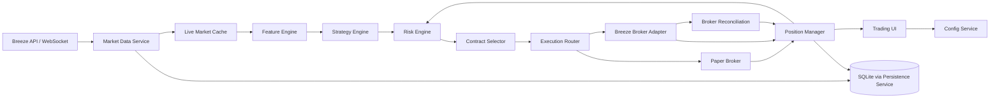
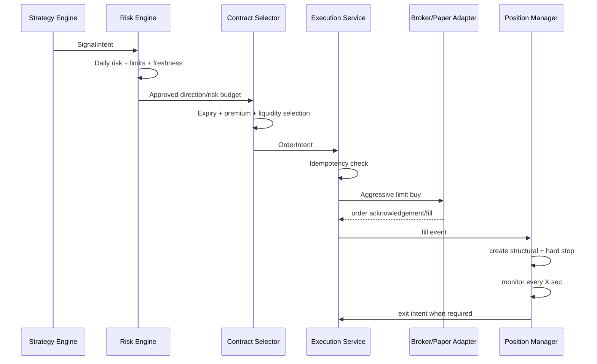

# NIFTY Intraday Options Auto-Trading — Implementation Specification

**Version:** 1.0  
**Date:** 17 September 2026  
**Broker/API target:** ICICI Direct Breeze API  
**Instrument:** NIFTY 50 index options  
**Trading style:** Intraday long-option directional trading (CE/PE)  
**Primary strategies:**
1. Trend Pullback Continuation
2. Volatility Compression Breakout

---

## 1. Objective

Build an automated NIFTY intraday options engine that:

- Detects high-quality intraday directional swings.
- Estimates whether enough movement remains to justify a trade.
- Uses NIFTY price structure, NIFTY futures volume/OI, and option-chain OI/volume together.
- Selects an option contract automatically subject to a configurable **maximum option premium**.
- Places a trade automatically when all criteria are satisfied.
- Supports both **PAPER/SIMULATION** and **LIVE** modes through the same strategy and execution interfaces.
- Applies an initial stop immediately after entry.
- Trails profitable trades automatically.
- Detects weakening/reversal conditions and exits before the full stop when the original thesis deteriorates.
- Tracks every signal, order, fill, stop modification, exit, P&L change, and strategy decision in the UI and database.
- Fails safe when data, broker connectivity, session state, or internal state becomes unreliable.

The system is designed for **positive expectancy**, not a high win rate. Small controlled losses and a minority of larger trend winners are acceptable and expected.

---

# 2. Core Design Principles

## 2.1 Underlying controls the thesis; option controls execution

The option premium should not be the primary source for deciding market direction.

Use:

- **NIFTY spot** for index price structure, swing levels, ATR, EMA, Supertrend, RSI, ADX, opening range, and breakout/pullback levels.
- **Front-month NIFTY futures** for traded volume, VWAP, RVOL, futures OI, and futures OI-price classification.
- **NIFTY option chain** for strike selection, liquidity, option OI/Change-OI, option volume, support/resistance confirmation, and execution price.

The principal structural stop is expressed in NIFTY points. A separate option-premium hard stop is used as a fail-safe.

## 2.2 OI is confirmation, not a standalone direction signal

Open interest does not independently identify a buyer or writer. Infer probable positioning from:

- change in underlying/futures price,
- change in option premium,
- change in OI,
- traded volume,
- strike location relative to spot,
- behavior across neighboring strikes.

Never implement rules such as `PCR > 1 => BUY CE` or `maximum Call OI => short immediately`.

## 2.3 Stream fast data; poll/evaluate on a configurable schedule

The UI must expose an interval `X` seconds, but the architecture should be hybrid:

- **WebSocket:** continuous live quotes/OHLC/order notifications when available.
- **Configurable scheduler:** refresh option-chain/OI snapshots and execute strategy/risk evaluation every `X` seconds.
- **REST fallback:** recover missing snapshots/reconcile broker state.

This provides low latency without burning REST API quota.

## 2.4 Fail closed

If critical inputs are stale or inconsistent, do not open a trade.

Examples:

- WebSocket disconnected and no fresh fallback data.
- Option-chain snapshot stale.
- Broker session invalid.
- Live positions differ materially from local state.
- Order state unknown.
- Daily risk limit reached.
- API quota guard triggered.

Existing live positions must still be managed by the recovery/exit path.

---

# 3. Current Broker/Exchange Constraints to Encode

These values must be represented as configuration/capability rules, not scattered through strategy code.

## 3.1 NIFTY expiry

As of 17 September 2026, NSE states:

- NIFTY weekly options expire on **Tuesday**.
- Monthly NIFTY options expire on the **last Tuesday** of the expiry month.
- If Tuesday is a trading holiday, expiry moves to the previous trading day.
- NIFTY has 4 weekly expirations excluding the monthly contract, plus monthly/longer-dated contracts.

Do not hard-code old Thursday-expiry assumptions.

## 3.2 Breeze API limits and execution behavior

Current official Breeze documentation states approximately:

- REST/API rate limit: **100 calls/minute** and **5,000 calls/day**.
- Breeze SDK regulatory notes also state a combined order action limit of up to **10 order placement/cancel/modify/square-off requests per second**.
- Orders must originate from the static IP registered with ICICI Direct.
- Market orders are not permitted through Breeze under current regulatory handling; market requests are handled as aggressive limit orders. Our code should explicitly place controlled limit/aggressive-limit orders rather than depending on implicit conversion.
- Order notifications and market feeds are available over WebSocket.

Internal guardrails should be stricter than broker limits, for example:

```yaml
broker_limits:
  max_rest_calls_per_minute: 90
  max_rest_calls_per_day: 4500
  max_order_actions_per_second: 5
```

These are **internal safety ceilings**, not claims about the broker's contractual limits.

---

# 4. High-Level Architecture



## 4.1 Recommended services/modules

1. **market-data-service**
   - WebSocket connections.
   - Quote normalization.
   - REST option-chain refresh.
   - Candle construction.
   - Data freshness monitoring.

2. **feature-engine**
   - EMA, ATR, RSI, ADX, Supertrend.
   - futures VWAP.
   - RVOL.
   - Bollinger Band Width.
   - swing pivots.
   - futures OI classification.
   - option OI flow and support/resistance metrics.
   - expected-move context.

3. **strategy-service**
   - Strategy A: Trend Pullback Continuation.
   - Strategy B: Volatility Compression Breakout.
   - Signal scoring and state machines.

4. **risk-service**
   - daily loss limits.
   - per-trade risk.
   - capital allocation.
   - trade-count limits.
   - concurrent-position limits.
   - circuit breaker.

5. **contract-selector-service**
   - expiry selection.
   - strike discovery.
   - max-premium selection.
   - liquidity filtering.

6. **execution-service**
   - paper broker adapter.
   - Breeze broker adapter.
   - idempotent order intents.
   - aggressive limit/repricing logic.
   - partial-fill handling.

7. **position-manager-service**
   - structural SL.
   - hard premium SL.
   - R-multiple state.
   - trailing SL.
   - reversal/health score.
   - exit orchestration.

8. **persistence-service**
   - sole writer to SQLite where practical.
   - SQLite WAL mode.
   - append-only audit/event tables.

9. **UI/API service**
   - strategy configuration.
   - PAPER/LIVE mode.
   - auto-trade arm/disarm.
   - dashboards and trade history.

> If the project remains microservice-based while using SQLite, avoid many services writing directly to the same SQLite file. Use a single persistence boundary or event writer. SQLite is excellent for local deployment, but concurrent multi-process write patterns must be controlled.

---

# 5. Runtime Modes

```text
DISABLED
PAPER
LIVE
```

## 5.1 PAPER

- Real market data.
- Real strategy logic.
- Real contract selection.
- Simulated orders/fills.
- No broker order placement.
- Same trade/position/trailing code as LIVE.

## 5.2 LIVE

- Real market data.
- Real strategy logic.
- Real broker orders.
- Broker order notifications reconciled against local state.

## 5.3 Mode-switch rule

Never switch an open position from PAPER to LIVE or LIVE to PAPER.

A mode change applies only when:

```text
open_positions == 0
AND
pending_orders == 0
```

Otherwise reject the change.

---

# 6. UI Configuration

## 6.1 Global trading controls

```yaml
trading:
  mode: PAPER                 # PAPER | LIVE
  auto_trade_enabled: true
  system_armed: false         # must be armed before automatic live entry
  kill_switch: false
  timezone: Asia/Kolkata
```

`system_armed` is a session-level operational control. Once armed, no human involvement is required for individual entries, stop updates, or exits.

## 6.2 Market-data configuration

```yaml
market_data:
  strategy_evaluation_interval_sec: 2
  option_chain_refresh_interval_sec: 5
  broker_reconciliation_interval_sec: 15
  max_quote_age_sec: 3
  max_option_chain_age_sec: 8
  use_websocket: true
  use_rest_fallback: true
```

### Interval validation

Before saving a polling configuration, calculate estimated REST usage:

```text
estimated_calls_per_minute =
    chain_calls_per_refresh * (60 / option_chain_refresh_interval_sec)
    + reconciliation_calls
    + safety_overhead
```

Reject a configuration that would exceed the internal API budget.

Example:

- CE chain call = 1
- PE chain call = 1
- refresh every 5 seconds

```text
2 * (60 / 5) = 24 option-chain calls/minute
```

This leaves capacity for reconciliation/orders.

Do not allow a UI setting such as a 1-second full REST option-chain refresh if it would breach the rate budget. Live quotes should come from WebSocket instead.

## 6.3 Option contract controls

```yaml
option_selection:
  max_option_premium: 70.00
  min_option_premium: 15.00
  max_otm_strikes: 4
  min_open_interest: 10000
  max_bid_ask_spread_pct: 3.0
  prefer_premium_closest_to_cap: true
  allow_current_expiry_when_dte_lte: 1
  use_current_expiry_on_0dte: false
```

`min_open_interest` and spread threshold must remain configurable and should later be optimized from collected live data.

## 6.4 Capital/risk controls

Maximum premium is **not** the same as maximum capital per trade.

```yaml
risk:
  max_trade_capital: 50000
  risk_per_trade_pct_of_account: 0.50
  max_daily_loss_r: 2.0
  max_daily_loss_pct: 1.5
  max_failed_trades_per_strategy: 2
  max_trades_per_day: 5
  max_concurrent_positions: 1
  cooldown_after_loss_min: 10
  option_hard_stop_pct: 25
```

Both `max_trade_capital` and risk sizing must be satisfied.

## 6.5 Trading-time controls

```yaml
session:
  no_new_trade_before: "09:30"
  no_new_trade_after: "14:45"
  force_exit_time: "15:20"
  disable_0dte_by_default: true
```

Times are configurable.

---

# 7. Market Data Requirements

## 7.1 NIFTY spot/index

Required fields:

- timestamp
- last price
- 1m OHLC
- 5m OHLC
- 15m OHLC

Derived:

- EMA 9 / 20 / 50
- RSI 14
- ATR 14
- ADX 14 / +DI / -DI
- Supertrend 10,3
- Bollinger Bands 20,2
- Bollinger Band Width
- swing highs/lows
- opening range
- daily ATR

## 7.2 Front-month NIFTY futures

Required:

- LTP
- OHLC
- total traded quantity/volume
- OI
- Change OI if available
- best bid/offer if used

Derived:

- session VWAP
- 5m volume
- RVOL
- 5m OI velocity
- OI acceleration
- futures buildup classification

## 7.3 NIFTY option chain

For near-ATM strikes, store:

- strike
- CE/PE
- expiry
- LTP
- bid
- ask
- traded quantity/volume
- OI
- change OI
- timestamp
- spot/reference price

Maintain at minimum:

```text
ATM +/- 5 strikes
```

Use a wider chain for strike selection if required by `max_otm_strikes`.

---

# 8. Candle and Evaluation Rules

There are two different loops.

## 8.1 Signal loop

Entry signals use **closed candles** unless a strategy explicitly says otherwise.

```text
5m candle closes
    -> refresh features
    -> evaluate strategy
    -> if signal confirmed, submit order immediately
```

This prevents an incomplete 5m candle from producing a signal that disappears before close.

## 8.2 Position-risk loop

Open positions are evaluated every configured `X` seconds.

This loop handles:

- underlying structural stop,
- premium hard stop,
- trade-health deterioration,
- reversal score,
- R-multiple advancement,
- trailing-stop movement,
- stale-data safety.

This loop does **not** wait for a 5-minute close for catastrophic risk exits.

---

# 9. Indicator Definitions

## 9.1 Futures session VWAP

```text
TypicalPrice = (High + Low + Close) / 3
VWAP = cumulative(TypicalPrice * Volume) / cumulative(Volume)
```

Reset each session.

Do not calculate index VWAP from NIFTY spot because the index itself does not have exchange-traded volume. Use NIFTY futures VWAP.

## 9.2 Relative Volume (RVOL)

Use time-of-day normalization.

```text
RVOL_5m(t) =
Current 5m futures volume at time bucket t
/
Median volume for same time bucket over previous N sessions
```

Default:

```yaml
rvol_lookback_sessions: 20
```

Initial interpretation:

```text
< 0.80     low
0.80-1.20 normal
1.20-1.50 elevated
> 1.50     strong
> 2.00     exceptional
```

These bands must be backtested.

## 9.3 OI velocity

```text
OI_velocity_5m = (OI_now - OI_5m_ago) / max(OI_5m_ago, epsilon)

OI_acceleration = OI_velocity_current - OI_velocity_previous
```

## 9.4 Futures OI classification

Using 5m changes:

| Futures Price | Futures OI | Classification | Direction score |
|---|---:|---|---:|
| Up | Up | probable long buildup | +1 |
| Down | Up | probable short buildup | -1 |
| Up | Down | probable short covering | +0.5 |
| Down | Down | probable long unwinding | -0.5 |

Require minimum change thresholds to avoid classifying noise.

Initial configurable defaults:

```yaml
futures_oi:
  min_price_change_pct: 0.05
  min_oi_change_pct: 0.25
```

## 9.5 Option price/OI inference

| Option Price | OI | Probable activity |
|---|---:|---|
| Up | Up | long option buildup |
| Down | Up | probable short buildup/writing |
| Up | Down | probable short covering |
| Down | Down | probable long unwinding |

Interpret only with the underlying direction and neighboring strikes.

---

# 10. Derivatives Confirmation Score

Calculate a directional score on each evaluation.

## 10.1 Bullish score

```text
+1.0  Futures probable long buildup
+0.5  Futures short covering
+1.0  Futures RVOL >= 1.3 on confirmation candle
+1.0  Net put writing/support developing at ATM/below ATM
+1.0  Call OI unwinding / short-covering near ATM or first resistance
+0.5  Near-ATM Put OI flow stronger than Call OI flow in bullish context
-1.0  Strong fresh call writing directly above price
-1.0  Futures short buildup
-1.0  Strong put unwinding beneath price
```

## 10.2 Bearish score

Mirror the logic.

```text
+1.0  Futures probable short buildup
+0.5  Futures long unwinding
+1.0  Futures RVOL >= 1.3 on confirmation candle
+1.0  Net call writing/resistance developing at ATM/above ATM
+1.0  Put OI unwinding / put long buildup supportive of downside context
...
```

Expose separately:

```text
bull_derivatives_score
bear_derivatives_score
```

Do not collapse them prematurely into a single opaque number in storage.

---

# 11. OI Support/Resistance Map

For every strike in `ATM +/- 5` calculate a normalized level strength.

Suggested model:

```text
LevelStrength =
  0.45 * OI_percentile
+ 0.35 * positive_change_OI_percentile
+ 0.20 * volume_percentile
```

Then apply activity interpretation.

A large static OI level with rapidly falling OI should be treated as weakening.

Example:

```text
25,600 CE large OI + OI decreasing sharply
=> historical resistance exists but current resistance is weakening
```

Do not treat max-OI strikes as permanent walls.

---

# 12. Expected-Movement Context

Expected move is context, not a guaranteed target.

## 12.1 ATR

Calculate:

- 5m ATR(14)
- daily ATR(14)

## 12.2 India VIX estimate when available

Approximate one-standard-deviation daily move:

```text
DailyExpectedMovePct ~= IndiaVIX / sqrt(252)
DailyExpectedMovePoints = Spot * DailyExpectedMovePct / 100
```

Approximate remaining-session component:

```text
RemainingSessionMove ~=
DailyExpectedMovePoints * sqrt(minutes_remaining / session_minutes)
```

Treat this only as a volatility context estimate.

## 12.3 ATM straddle context

```text
ATM_Straddle = ATM_CE_mid + ATM_PE_mid
```

This represents option-implied range to that expiry, not a guaranteed same-day range.

Use it to detect whether the market may already have consumed an unusually large portion of the option-implied range.

## 12.4 Expected-move exhaustion filter

Do not reject every trade after a large move. Instead penalize new entries if all are true:

- session move already exceeds a configured share of daily ATR/VIX estimate,
- RVOL is falling,
- derivatives confirmation weakens,
- entry would require chasing > configured ATR distance from the trigger level.

---

# 13. STRATEGY A — Trend Pullback Continuation

## 13.1 Purpose

Enter after a controlled pullback inside an established intraday trend rather than chasing an extended move.

This is the **primary/higher-confidence strategy**.

## 13.2 Timeframes

```text
Regime:       15m
Entry setup:   5m
Risk loop:     X seconds
Execution:     live quote/order book
```

## 13.3 Bullish regime

All mandatory conditions:

```text
15m EMA20 > EMA50
15m EMA20 slope > 0 over last 3 closed bars
15m close > EMA20
15m ADX(14) >= 20
15m +DI > -DI
5m Supertrend(10,3) bullish
Front NIFTY future > session futures VWAP
No global no-trade condition
```

Preferred confirmation:

```text
bull_derivatives_score >= +2
```

High-confidence classification:

```text
bull_derivatives_score >= +3
AND trigger RVOL >= 1.2
```

## 13.4 Bearish regime

Mirror:

```text
EMA20 < EMA50
EMA20 slope < 0
close < EMA20
ADX >= 20
-DI > +DI
Supertrend bearish
futures < futures VWAP
bear_derivatives_score >= +2
```

## 13.5 Pullback detection — bullish

Identify the preceding impulse leg and then the pullback.

A pullback candidate requires:

```text
2 to 6 closed 5m bars since local impulse high
price retraces toward at least one of:
    5m EMA20
    prior breakout level
    recent higher-low support
    futures VWAP proximity

pullback does not break the latest confirmed 15m swing low
pullback depth <= 0.60 of preceding impulse distance
```

Volume quality:

```text
pullback_volume_ratio =
avg futures 5m volume during pullback
/
avg futures 5m volume during preceding impulse
```

Initial preference:

```text
pullback_volume_ratio <= 0.80  => healthy
0.80-1.00                     => acceptable
> 1.00                        => quality penalty
> 1.30                        => reject unless derivatives score exceptionally strong
```

These values must be validated empirically.

## 13.6 Bullish entry trigger

On a **closed 5m candle**:

```text
regime_bullish == true
AND pullback_detected == true
AND candle close > previous 5m candle high
AND candle close > EMA9
AND RSI(14) >= 52
AND futures price > futures VWAP
AND bull_derivatives_score >= +2
AND trigger candle is not > 1.8 * ATR(5m) in range
AND chase_distance_from_trigger <= 0.35 * ATR(5m)
```

Trigger creates:

```text
SignalIntent(direction=CALL, strategy=TREND_PULLBACK)
```

## 13.7 Bearish entry trigger

Mirror the bullish logic and create a PE intent.

## 13.8 Initial underlying stop — bullish

```text
candidate_stop = pullback_swing_low - 0.15 * ATR_5m
R_points = entry_spot - candidate_stop
```

Require:

```text
0.50 * ATR_5m <= R_points <= 1.50 * ATR_5m
```

If risk is outside the band, skip the trade rather than arbitrarily widening/narrowing the structural stop.

Bearish stop:

```text
pullback_swing_high + 0.15 * ATR_5m
```

## 13.9 Initial target state

Do not place one fixed take-profit as the primary exit.

Track:

```text
T1 = entry + 1R
T2 = entry + 1.5R
T3 = entry + 2R
```

Inverse for PE/downside.

The targets are **state transitions**, not mandatory full exits.

## 13.10 Trade management

### Before +0.75R

- Keep structural SL.
- Exit early only on thesis failure/reversal rules.

### At +0.75R

- Tighten excessive risk if a new valid swing has formed.
- Do not force break-even yet.

### At +1R

Move protected underlying stop to approximately:

```text
max(entry + cost_buffer, latest valid 5m higher low - 0.10*ATR)
```

For bearish, mirror.

### At +1.5R

Lock at least approximately `+0.5R`, subject to market structure.

### At +2R

Switch to runner mode.

Suggested bullish trail:

```text
trail = max(
    latest confirmed 5m swing low,
    EMA9 - 0.25 * ATR_5m,
    highest_5m_close_since_entry - 1.0 * ATR_5m
)
```

Never loosen the trailing stop.

## 13.11 Trend Pullback invalidation

Exit immediately if any hard condition occurs:

```text
spot/futures breaches structural stop
OR option hard stop is hit
OR strategy data becomes critically stale and safe broker exit is possible
```

Exit on closed-candle thesis failure when:

```text
5m close below pullback swing low (bullish trade)
```

Mirror for bearish.

---

# 14. STRATEGY B — Volatility Compression Breakout

## 14.1 Purpose

Capture directional expansion after a low-volatility consolidation.

This is the **more aggressive strategy**, but volume/OI confirmation is mandatory to reduce false breakouts.

## 14.2 Compression definition

Use 5m bars.

Compression candidate requires all:

```text
BBWidth(20,2) <= 25th percentile of rolling historical BBWidth
ATR_5m <= 30th percentile of recent session-normalized ATR
at least 4 consecutive 5m bars in a bounded range
range duration between 20 and 60 minutes
range height <= 1.75 * ATR_5m
```

Store:

```text
compression_high
compression_low
compression_height
compression_start
compression_end
```

Opening range (default):

```text
09:15-09:30
```

The breakout may be from the compression range even when it is not the opening range.

## 14.3 Bullish breakout trigger

On a closed 5m bar:

```text
close > compression_high + 0.10 * ATR_5m
AND futures close > futures VWAP
AND futures RVOL >= 1.30
AND candle body / candle range >= 0.60
AND bull_derivatives_score >= +2
AND no strong fresh call-writing wall immediately above entry
AND breakout extension from compression_high <= 0.80 * ATR_5m
```

Preferred:

```text
ADX rising over last 3 closed 5m bars
AND +DI > -DI
```

If price has already run >0.80 ATR beyond the breakout level before order submission, skip rather than chase.

## 14.4 Bearish breakout

Mirror all logic.

## 14.5 Initial stop — bullish

Primary failed-breakout stop:

```text
candidate_stop = compression_high - 0.25 * ATR_5m
R_points = entry - candidate_stop
```

Require reasonable R band:

```text
0.40 * ATR_5m <= R_points <= 1.25 * ATR_5m
```

If the compression is unusually wide and stop exceeds the band, skip.

## 14.6 Immediate false-breakout exit

Exit a bullish breakout if:

```text
5m close returns inside compression range
```

Exit even faster if the position-risk loop sees all:

```text
price back below breakout level
AND futures below VWAP
AND bull derivatives score collapses/reverses
```

Do not wait for the option to lose 25% when the breakout has clearly failed.

## 14.7 Breakout targets/trailing

Track:

```text
1R
1.5R
2R
MeasuredMove = compression_high + compression_height
```

Use the measured move as context, not a forced full exit.

At +1R, protect near break-even.
At +1.5R, lock profit.
At +2R, use trailing/runner mode.

---

# 15. Shared Reversal / Trade-Health Engine

This engine runs every configured `X` seconds and on closed 1m/5m bars.

## 15.1 Bullish-position reversal score

Add one point for each confirmed condition:

```text
1  spot 5m close < EMA9
1  futures < session VWAP
1  Supertrend flips bearish
1  RSI(14) < 48
1  -DI crosses above +DI
1  lower high forms after entry
1  latest 5m higher low is broken
1  futures OI/price changes to strong short-buildup classification
1  put support OI begins unwinding materially
1  fresh call writing strengthens directly above/current spot
```

Use hysteresis/debounce so one noisy tick cannot toggle a condition repeatedly.

## 15.2 Action matrix

```text
score 0-1: HOLD
score 2:   TIGHTEN only; no immediate exit
score 3:
    if trade PnL < 0R: EXIT
    if 0R <= PnL < 1R: EXIT or very tight stop (default EXIT)
    if PnL >= 1R: tighten to latest 1m/5m structure, never below protected profit
score >=4: EXIT FULL POSITION
```

For bearish positions, invert conditions.

## 15.3 Profit protection precedence

A trailing stop can only move in the direction of profit protection.

```text
new_stop_long = max(old_stop_long, candidate_stop_long)
new_stop_short = min(old_stop_short, candidate_stop_short)
```

Never loosen because a later indicator calculation changed.

---

# 16. Option Selection with Maximum Premium

This directly implements the requirement:

> If 23,400 CE is about ₹150 and 23,600 CE is about ₹60, and max option premium is ₹70, prefer an eligible liquid contract around ₹60 rather than the ₹150 contract.

## 16.1 Definitions

```text
max_option_premium = user-configured executable premium cap
```

Use **best ask** for a buy decision, not stale LTP.

## 16.2 Expiry selection

Default:

```text
if DTE >= 2:
    use nearest weekly expiry
elif DTE <= 1 and use_current_expiry_when_dte_lte == false:
    use next weekly expiry
elif DTE == 0 and use_current_expiry_on_0dte == false:
    use next weekly expiry
else:
    use current weekly
```

Expiry policy is configurable.

## 16.3 Strike candidate set

For bullish signal:

```text
ATM CE
ATM + 1 strike CE
ATM + 2 strike CE
...
ATM + max_otm_strikes CE
```

For bearish signal:

```text
ATM PE
ATM - 1 strike PE
...
ATM - max_otm_strikes PE
```

Optionally include one ITM strike if its ask is below the cap.

Strike intervals must be discovered from current listed instruments/chain, not hard-coded.

## 16.4 Eligibility filter

A contract is eligible only if:

```text
best_ask > 0
best_bid > 0
best_ask <= max_option_premium
best_ask >= min_option_premium
OI >= min_open_interest
spread_pct <= max_bid_ask_spread_pct
quote_age <= max_quote_age
OTM_distance <= max_otm_strikes
```

Where:

```text
mid = (bid + ask) / 2
spread_pct = (ask - bid) / mid * 100
```

Also reject abnormal locked/crossed/stale books.

## 16.5 Ranking

Default ranking:

1. premium closest to but **not above** maximum premium,
2. lower spread,
3. higher OI percentile,
4. higher recent volume percentile,
5. smaller OTM distance.

Equivalent simple sort key:

```python
eligible.sort(
    key=lambda x: (
        -x.best_ask,          # closest under premium cap
        x.spread_pct,
        -x.oi_percentile,
        -x.volume_percentile,
        x.otm_distance,
    )
)
```

If no eligible contract exists:

```text
NO TRADE: PREMIUM_LIQUIDITY_FILTER_FAILED
```

Do **not** keep moving farther OTM until a cheap option is found.

---

# 17. Position Sizing

Let:

```text
P = expected entry option premium
L = current NIFTY option lot size from instrument master
H = hard option stop percentage
C = max_trade_capital
A = account equity
RISK_PCT = configured risk per trade
```

## 17.1 Capital-limited lots

```text
capital_per_lot = P * L
capital_lots = floor(C / capital_per_lot)
```

## 17.2 Risk-limited lots

Conservative v1 estimate:

```text
risk_budget = A * RISK_PCT / 100
premium_risk_per_lot = P * H * L
```

Where `H` is decimal, e.g. 0.25.

```text
risk_lots = floor(risk_budget / premium_risk_per_lot)
```

## 17.3 Final quantity

```text
lots = min(capital_lots, risk_lots, strategy_max_lots)
quantity = lots * L
```

If `lots < 1`, do not trade.

A later version may estimate option value at the underlying structural stop using Greeks/IV. V1 should remain conservative and simple.

Never hard-code NIFTY lot size. Resolve it from the current instrument/security master.

---

# 18. Auto-Trade Execution Pipeline



## 18.1 No manual click after signal

When all are true:

```text
mode == LIVE
AND auto_trade_enabled == true
AND system_armed == true
AND kill_switch == false
AND signal valid
AND risk checks pass
AND contract selection succeeds
```

The system submits the order automatically.

In PAPER mode it performs the identical sequence through the simulated broker.

---

# 19. Order Placement Rules

## 19.1 Entry orders

Because market orders are not permitted by current Breeze rules, use controlled aggressive limit orders.

For a buy:

```text
reference = current best ask
entry_limit = min(
    max_option_premium,
    round_to_tick(reference + aggressive_offset)
)
```

Example offset policy:

```text
aggressive_offset = max(2 ticks, 0.25% of ask)
```

Do not place if:

```text
entry_limit > max_option_premium
```

## 19.2 Fill timeout/reprice

Example:

```yaml
execution:
  entry_order_ttl_ms: 1200
  max_entry_reprices: 2
  exit_order_ttl_ms: 700
  max_exit_reprices: 5
```

Entry behavior:

1. Place aggressive limit.
2. Wait for order notification.
3. If unfilled/partially filled at TTL:
   - verify signal still valid,
   - refresh book,
   - cancel/modify/reprice subject to rate limits and premium cap.
4. If still unfilled after max attempts, cancel remainder and record `ENTRY_NOT_FILLED`.

Do not chase beyond the configured premium cap.

## 19.3 Exit orders

For risk exits, premium cap no longer applies.

Use aggressive sell limit around best bid and reprice quickly until filled, while obeying exchange/broker price rules and rate controls.

All exit intents should carry urgency:

```text
NORMAL_TRAIL
REVERSAL
STRUCTURAL_STOP
HARD_STOP
FORCE_EXIT
KILL_SWITCH
```

Risk exits receive higher execution priority.

---

# 20. Idempotency and Duplicate-Order Protection

Every strategy signal has a unique ID:

```text
signal_id = strategy + direction + setup_timestamp + setup_level_hash
```

Before submitting an order:

```text
if signal_id already has OPEN/PENDING/FILLED order:
    reject duplicate
```

Also enforce:

```text
one active position per strategy/direction unless explicitly configured
max_concurrent_positions default = 1
```

Persist the order intent **before** calling the broker.

---

# 21. Paper/Simulator Execution Model

Paper mode must not simply fill every order at LTP.

## 21.1 Buy fill

```text
fill_price = ask + simulated_slippage
```

## 21.2 Sell fill

```text
fill_price = bid - simulated_slippage
```

Config:

```yaml
paper:
  latency_ms: 250
  slippage_ticks: 1
  use_bid_ask: true
  simulate_partial_fills: false
```

V2 can use displayed depth to simulate partial fills.

## 21.3 Same lifecycle as live

Paper trades must generate the same event types:

```text
ORDER_SUBMITTED
ORDER_ACKNOWLEDGED
PARTIAL_FILL
FILLED
STOP_UPDATED
EXIT_SUBMITTED
CLOSED
```

This lets the UI and analytics remain mode-agnostic.

---

# 22. Position State Machine

```text
SIGNAL_DETECTED
    |
    v
PRE_TRADE_VALIDATION
    |
    v
ORDER_PENDING
    |
    v
OPEN_INITIAL_RISK
    |
    +--> EARLY_FAILURE --> EXITING --> CLOSED
    |
    v
PROFIT_PROTECTION_0_75R
    |
    v
BREAK_EVEN_1R
    |
    v
LOCKED_PROFIT_1_5R
    |
    v
RUNNER_2R_PLUS
    |
    v
EXITING
    |
    v
CLOSED
```

On every state transition persist:

- timestamp,
- NIFTY price,
- futures price,
- option premium,
- old stop,
- new stop,
- R multiple,
- reversal score,
- derivatives score,
- reason.

---

# 23. Stop-Loss Hierarchy

Evaluate in priority order.

## Level 1 — Kill/emergency

- manual kill switch,
- unrecoverable order-state mismatch,
- broker critical error with open exposure,
- end-of-day forced exit.

## Level 2 — Structural stop

Based on NIFTY thesis level.

## Level 3 — Option premium hard stop

Default:

```text
entry_premium * (1 - 0.25)
```

This is a fail-safe, not the desired normal exit.

## Level 4 — Early thesis deterioration

Reversal/trade-health engine can exit before Levels 2/3.

## Level 5 — Profit trail

R-based and structure-based trailing.

---

# 24. Stale Data Safety

Each normalized quote contains:

```text
exchange_timestamp
received_timestamp
source
sequence_or_local_counter
```

Before entry require:

```text
spot_age <= max_quote_age_sec
futures_age <= max_quote_age_sec
selected_option_age <= max_quote_age_sec
option_chain_age <= max_option_chain_age_sec
```

If stale:

```text
NO_NEW_ENTRY
```

If a position is already open:

- continue broker/order reconciliation,
- attempt alternate fresh source/REST quote,
- if risk cannot be evaluated for a configurable timeout, transition to safe exit policy.

---

# 25. No-Trade Conditions

Skip new entries when any applies:

1. Before configured start time.
2. After configured last-entry time.
3. 0DTE current-expiry trading disabled.
4. Daily loss limit reached.
5. Failed-trade limit reached.
6. Max trades reached.
7. Cooldown active after a loss.
8. Market-data stale.
9. Broker session unhealthy.
10. Bid/ask spread too wide.
11. No acceptable option under max premium.
12. Selected option is too far OTM.
13. Entry candle is excessively large/extended.
14. Expected-move exhaustion + weakening participation filter fires.
15. Strategy signal conflicts strongly with derivatives confirmation.
16. Existing conflicting/open position.
17. Kill switch on.
18. Live mode not armed.

Optional event calendar filter may be added later for RBI policy, major budget/event days, etc.

---

# 26. Trade Tracking UI

## 26.1 Top status bar

Display:

```text
MODE: PAPER/LIVE
AUTO TRADE: ON/OFF
ARMED: YES/NO
BREEZE: CONNECTED/DISCONNECTED
WEBSOCKET: HEALTHY/STALE
REST BUDGET: calls/min + daily count
DAILY P&L
DAILY R
OPEN EXPOSURE
```

## 26.2 Market state card

```text
NIFTY Spot
NIFTY Futures
Trend: Bull/Bear/Neutral
15m ADX
Futures VWAP relation
RVOL
Futures OI classification
Bull OI score
Bear OI score
Expected-move context
```

## 26.3 Strategy cards

For each strategy show:

```text
Enabled
State: SEARCHING / SETUP / TRIGGERED / COOLDOWN
Direction
Conditions passed / total
Block reason
Last signal timestamp
```

Example:

```text
Trend Pullback — BULLISH SETUP
[✓] EMA trend
[✓] ADX
[✓] Futures > VWAP
[✓] Pullback detected
[✓] Low pullback volume
[✗] Trigger candle not closed
OI confirmation: +3
```

## 26.4 Open trade card

```text
Mode
Strategy
Direction
Expiry
Strike
CE/PE
Quantity
Entry premium
Current premium
NIFTY entry
NIFTY current
Initial stop
Current trailing stop
R multiple
Unrealized P&L
Peak P&L
Reversal score
Trade-health state
```

## 26.5 Order/trade history

Columns:

```text
Trade ID
Mode
Strategy
Entry time
Exit time
Contract
Qty
Entry
Exit
Gross P&L
Costs
Net P&L
R multiple
Max Favorable Excursion
Max Adverse Excursion
Exit reason
```

## 26.6 Live decision log

Show human-readable reasons:

```text
10:35:01 Trend Pullback bullish setup detected
10:35:02 Bull derivatives score = +3
10:35:02 23,400 CE rejected: ask ₹151.2 > max ₹70
10:35:02 23,600 CE selected: ask ₹60.4, spread 1.1%
10:35:03 PAPER BUY 1 lot @ ₹60.50
10:47:15 Trade reached +1R; stop moved to break-even + costs
11:02:04 Reversal score increased 1 -> 3
11:02:04 Profit protected; exit submitted
```

This auditability is critical for improving the strategy later.

---

# 27. SQLite Data Model

Suggested tables.

## 27.1 `runtime_config`

```text
key
value_json
updated_at
version
```

## 27.2 `strategy_config`

```text
strategy_id
strategy_name
enabled
params_json
version
updated_at
```

## 27.3 `market_snapshot`

Store sampled/decision-time snapshots rather than every raw tick if database size is a concern.

```text
id
ts
spot
future
future_oi
future_volume
future_vwap
rvol
atm
bull_oi_score
bear_oi_score
option_chain_snapshot_id
```

## 27.4 `signals`

```text
signal_id
strategy_id
ts
direction
status
spot_price
future_price
trigger_level
structural_stop
r_points
score_json
block_reason
features_json
```

## 27.5 `orders`

```text
local_order_id
broker_order_id
signal_id
trade_id
mode
side
contract
quantity
order_type
limit_price
status
submitted_at
updated_at
raw_broker_response_json
```

## 27.6 `fills`

```text
fill_id
order_id
quantity
price
ts
broker_trade_id
```

## 27.7 `trades`

```text
trade_id
mode
strategy_id
direction
expiry
strike
right
quantity
entry_ts
entry_option_price
entry_spot
entry_future
initial_structural_stop
initial_r_points
current_stop
state
peak_r
mfe
mae
exit_ts
exit_option_price
exit_spot
exit_reason
gross_pnl
costs
net_pnl
realized_r
```

## 27.8 `stop_history`

```text
id
trade_id
ts
old_stop
new_stop
option_hard_stop
r_multiple
reason
reversal_score
```

## 27.9 `risk_events`

```text
id
ts
type
severity
trade_id
message
data_json
```

## 27.10 `audit_events`

Append-only.

```text
id
ts
service
event_type
entity_id
payload_json
```

Enable WAL mode and migrations.

---

# 28. API/Domain Objects

## 28.1 `SignalIntent`

```json
{
  "signal_id": "...",
  "strategy": "TREND_PULLBACK",
  "direction": "BULLISH",
  "option_right": "CALL",
  "trigger_ts": "...",
  "spot_entry_reference": 0,
  "structural_stop": 0,
  "r_points": 0,
  "derivatives_score": 0,
  "feature_snapshot_id": "..."
}
```

## 28.2 `OrderIntent`

```json
{
  "signal_id": "...",
  "mode": "PAPER",
  "action": "BUY",
  "stock_code": "NIFTY",
  "exchange_code": "NFO",
  "expiry": "...",
  "strike": 0,
  "right": "CALL",
  "quantity": 0,
  "limit_price": 0,
  "max_entry_premium": 70,
  "urgency": "NORMAL"
}
```

## 28.3 `TradeState`

```json
{
  "trade_id": "...",
  "state": "OPEN_INITIAL_RISK",
  "entry_spot": 0,
  "entry_option": 0,
  "initial_stop": 0,
  "current_stop": 0,
  "r_points": 0,
  "current_r": 0,
  "reversal_score": 0,
  "highest_r": 0
}
```

---

# 29. Core Scheduler Pseudocode

```python
async def strategy_scheduler():
    while session_open():
        cfg = config.current()

        await sleep_until_next_interval(cfg.strategy_evaluation_interval_sec)

        snapshot = market_cache.snapshot()

        if not data_health.entry_safe(snapshot, cfg):
            record_block("STALE_OR_INCOMPLETE_DATA")
            continue

        features = feature_engine.compute(snapshot)

        # New entries normally require newly closed 5m candle.
        if candle_service.has_new_closed_5m_bar():
            for strategy in enabled_strategies():
                signal = strategy.evaluate(features)

                if signal:
                    await auto_trade_pipeline(signal)

        # Open-position management runs every interval.
        for position in positions.open():
            await position_manager.evaluate(position, features)
```

---

# 30. Auto-Trade Pseudocode

```python
async def auto_trade_pipeline(signal):
    cfg = config.current()

    if not cfg.trading.auto_trade_enabled:
        return reject(signal, "AUTO_TRADE_DISABLED")

    if cfg.trading.kill_switch:
        return reject(signal, "KILL_SWITCH")

    if cfg.trading.mode == "LIVE" and not cfg.trading.system_armed:
        return reject(signal, "LIVE_NOT_ARMED")

    risk_result = risk_engine.validate_new_trade(signal)
    if not risk_result.approved:
        return reject(signal, risk_result.reason)

    contract = contract_selector.select(
        direction=signal.direction,
        max_premium=cfg.option_selection.max_option_premium,
        max_otm_strikes=cfg.option_selection.max_otm_strikes,
    )

    if not contract:
        return reject(signal, "NO_ELIGIBLE_OPTION")

    sizing = risk_engine.size_position(signal, contract)
    if sizing.lots < 1:
        return reject(signal, "INSUFFICIENT_RISK_CAPACITY")

    order_intent = execution.build_entry_order(signal, contract, sizing)

    # Persist before external side effect.
    order_repo.create(order_intent)

    broker = broker_router.for_mode(cfg.trading.mode)
    fill = await broker.execute_entry(order_intent)

    if fill:
        position_manager.open_from_fill(signal, contract, fill)
```

---

# 31. Contract Selection Pseudocode

```python
def select_contract(direction, chain, cfg):
    expiry = expiry_resolver.choose(chain.expiries, cfg)
    atm = nearest_strike(chain.spot, expiry)

    candidates = build_directional_candidates(
        atm=atm,
        direction=direction,
        max_otm_strikes=cfg.max_otm_strikes,
        include_one_itm=True,
    )

    eligible = []

    for c in candidates:
        q = chain.quote(expiry, c.strike, c.right)
        if q is None:
            continue
        if q.ask <= 0 or q.bid <= 0:
            continue
        if q.ask > cfg.max_option_premium:
            continue
        if q.ask < cfg.min_option_premium:
            continue
        if q.oi < cfg.min_open_interest:
            continue
        if spread_pct(q) > cfg.max_bid_ask_spread_pct:
            continue
        if q.is_stale:
            continue

        eligible.append(score_liquidity(q, c, cfg))

    if not eligible:
        return None

    # Highest premium below cap first, then liquidity quality.
    return sorted(
        eligible,
        key=lambda x: (
            -x.ask,
            x.spread_pct,
            -x.oi_percentile,
            -x.volume_percentile,
            x.otm_distance,
        )
    )[0]
```

---

# 32. Position-Management Pseudocode

```python
async def evaluate(position, features):
    current_r = calc_current_r(position, features.spot)

    if kill_switch_active():
        return await exit(position, "KILL_SWITCH")

    if hard_structural_stop_hit(position, features):
        return await exit(position, "STRUCTURAL_STOP")

    if premium_hard_stop_hit(position):
        return await exit(position, "OPTION_HARD_STOP")

    reversal = reversal_engine.score(position, features)

    if reversal >= 4:
        return await exit(position, "REVERSAL_SCORE_4_PLUS")

    if reversal >= 3 and current_r < 1.0:
        return await exit(position, "EARLY_THESIS_FAILURE")

    candidate_stop = position.current_stop

    if current_r >= 2.0:
        candidate_stop = runner_trail(position, features)
    elif current_r >= 1.5:
        candidate_stop = lock_half_r(position, features)
    elif current_r >= 1.0:
        candidate_stop = protect_break_even(position, features)
    elif current_r >= 0.75:
        candidate_stop = structure_tighten(position, features)

    if reversal == 2:
        candidate_stop = tighten_for_warning(position, features, candidate_stop)

    new_stop = monotonic_stop(position, candidate_stop)

    if new_stop != position.current_stop:
        persist_stop_change(position, new_stop, reversal)
        position.current_stop = new_stop
```

---

# 33. Broker Reconciliation

Do not trust only the local order state.

Periodically reconcile:

```text
local pending orders vs broker order list
local fills vs broker trades
local open positions vs broker positions
```

When mismatch found:

```text
NEW ENTRIES = DISABLED
position/order reconciliation = ACTIVE
severity = HIGH
```

If local system restarts while a live position exists:

1. Restore DB state.
2. Fetch broker positions/orders/trades.
3. Reconstruct actual quantity and average fill.
4. Reconstruct current stop from persisted stop history.
5. Resume position-risk loop.
6. Do not open another trade until reconciliation passes.

---

# 34. Session Start Workflow

```text
1. Start services
2. Load config
3. Connect Breeze session
4. Validate registered/static-IP connectivity
5. Load/refresh security master
6. Resolve current NIFTY expiries and lot size
7. Connect WebSockets
8. Download historical lookback needed for indicators/RVOL
9. Warm 1m/5m/15m candles
10. Refresh CE + PE option chain
11. Reconcile account positions/orders
12. Run data-health checks
13. PAPER mode can auto-arm if configured
14. LIVE remains unarmed until operationally armed
15. Strategy enters SEARCHING
```

---

# 35. Session End Workflow

At configured `force_exit_time`:

```text
NO_NEW_ENTRY
CANCEL pending entries
EXIT all strategy-owned intraday positions
VERIFY broker flat
PERSIST final P&L
CREATE daily strategy metrics
DISARM live trading
```

Never assume an exit succeeded because an API request was accepted. Confirm fill/flat position.

---

# 36. Risk Controls

Mandatory v1:

```text
Per-trade risk <= configured account percentage
Max trade capital
Max daily loss in R
Max daily loss in INR/%
Max trades/day
Max failed trades/strategy
Max concurrent positions
Cooldown after loss
No averaging down
No martingale sizing
No automatic doubling after loss
No unsupported 0DTE trading by default
No new entries after cutoff
End-of-day force exit
```

## 36.1 Daily circuit breaker

Trigger if either:

```text
realized_R <= -max_daily_loss_r
OR
realized_net_pnl_pct <= -max_daily_loss_pct
```

Then:

```text
AUTO ENTRY = DISABLED FOR REST OF SESSION
```

Existing position can still be managed/exited.

---

# 37. Strategy Interaction Rules

Both strategies can evaluate simultaneously, but they share one risk budget.

Default:

```text
max_concurrent_positions = 1
```

If both strategies signal the same direction on the same bar:

- do not open two positions,
- combine confidence metadata,
- create one trade,
- record both strategy confirmations if desired.

If they signal opposite directions:

```text
NO TRADE: STRATEGY_CONFLICT
```

unless a future explicit arbitration model is implemented.

---

# 38. Metrics for Evaluating Strategy Quality

Do not optimize primarily for win rate.

Track:

- net expectancy per trade,
- profit factor,
- average winner,
- average loser,
- win rate,
- average realized R,
- median realized R,
- maximum drawdown,
- consecutive losses,
- MFE,
- MAE,
- MFE capture ratio,
- percentage of +1R trades that became losses,
- percentage of +1.5R trades closed positive,
- early-exit benefit/harm,
- slippage,
- rejected signals by reason,
- fill rate,
- signal-to-fill latency,
- option spread at entry/exit,
- performance by time of day,
- performance by DTE,
- performance by RVOL regime,
- performance by ADX regime,
- performance by derivatives confirmation score.

### Key metric

```text
MFE Capture Ratio = Realized Profit / Maximum Favorable Excursion
```

This directly measures whether trailing logic is preserving enough of large moves.

---

# 39. Backtest Requirements

Backtests must avoid look-ahead bias.

Rules:

- use only closed bars available at each timestamp,
- OI snapshots must be timestamp-correct,
- use bid/ask where available,
- include slippage and brokerage/fees,
- model order fill latency,
- do not use end-of-day max OI values to make an earlier intraday decision,
- do not choose a strike using later prices,
- resolve historical expiry calendar correctly.

Because intraday historical option-chain/OI depth may be limited, distinguish:

```text
FULL-FIDELITY TEST
PARTIAL-FIDELITY TEST
```

Never claim equivalent confidence between them.

---

# 40. Paper-Trading Validation Gates Before Live

Recommended promotion gates; these are engineering gates, not promises of profitability.

## Gate 1 — Correctness

- zero duplicate orders,
- zero orphan positions,
- correct restart recovery,
- stops never loosen unexpectedly,
- every exit reason traceable.

## Gate 2 — Execution realism

- paper fill uses bid/ask,
- latency configured,
- actual live quotes saved for replay,
- slippage sensitivity tested.

## Gate 3 — Risk

- daily circuit breaker tested,
- kill switch tested,
- stale-data fail-safe tested,
- API-rate-limit guard tested,
- WebSocket disconnect tested.

## Gate 4 — Strategy observation

Collect enough trades across:

- trend days,
- range days,
- gap days,
- high VIX,
- low VIX,
- different DTEs.

Do not promote based only on a few successful paper sessions.

---

# 41. Test Cases

## 41.1 Premium-cap selection

Input:

```text
Max premium = ₹70
23,400 CE ask = ₹150
23,500 CE ask = ₹92
23,600 CE ask = ₹60
23,700 CE ask = ₹35
```

Assuming 23,600 and 23,700 pass liquidity filters:

```text
SELECT 23,600 CE @ ~₹60
```

Reason:

```text
highest eligible premium <= ₹70
```

## 41.2 No eligible premium

```text
₹68 option spread = 9%
₹55 option OI below threshold
₹40 option is beyond max OTM strikes
```

Expected:

```text
NO TRADE
```

## 41.3 Signal duplicate

Same strategy emits the same signal on two scheduler iterations.

Expected:

```text
ONE order only
```

## 41.4 Reversal before full SL

CE entered.

```text
Current PnL = -0.25R
Reversal score = 3
```

Expected:

```text
EXIT EARLY
```

## 41.5 Profit protection

```text
Position reaches +1.6R
Then reverses
```

Expected:

- stop has already advanced,
- trade should not revert to original full-risk stop,
- exit reason records trailing/profit-protection behavior.

## 41.6 Stale option chain

```text
Spot = fresh
Futures = fresh
Option chain age = 20 seconds
max allowed = 8 seconds
```

Expected:

```text
NO NEW ENTRY
```

## 41.7 Live mode not armed

```text
mode = LIVE
auto_trade_enabled = true
system_armed = false
```

Expected:

```text
signal visible in UI
no broker order
block reason LIVE_NOT_ARMED
```

---

# 42. Suggested REST/UI Endpoints

```text
GET  /api/trading/status
GET  /api/market/state
GET  /api/strategies
PUT  /api/strategies/{id}/config
PUT  /api/config/market-data
PUT  /api/config/risk
PUT  /api/config/option-selection
POST /api/trading/arm
POST /api/trading/disarm
POST /api/trading/kill-switch
POST /api/trading/kill-switch/reset
PUT  /api/trading/mode
GET  /api/trades/open
GET  /api/trades/history
GET  /api/orders
GET  /api/signals
GET  /api/audit
GET  /api/data-health
```

Live-mode mutations should be authenticated and audited.

---

# 43. Recommended Configuration — Initial Paper Trading

These are starting values to validate, not final optimized values.

```yaml
trading:
  mode: PAPER
  auto_trade_enabled: true
  system_armed: true
  kill_switch: false

market_data:
  strategy_evaluation_interval_sec: 2
  option_chain_refresh_interval_sec: 5
  broker_reconciliation_interval_sec: 15
  max_quote_age_sec: 3
  max_option_chain_age_sec: 8
  use_websocket: true

option_selection:
  max_option_premium: 70
  min_option_premium: 15
  max_otm_strikes: 4
  min_open_interest: 10000
  max_bid_ask_spread_pct: 3.0
  use_current_expiry_on_0dte: false

risk:
  max_trade_capital: 50000
  risk_per_trade_pct_of_account: 0.50
  max_daily_loss_r: 2.0
  max_daily_loss_pct: 1.5
  max_failed_trades_per_strategy: 2
  max_trades_per_day: 5
  max_concurrent_positions: 1
  cooldown_after_loss_min: 10
  option_hard_stop_pct: 25

session:
  no_new_trade_before: "09:30"
  no_new_trade_after: "14:45"
  force_exit_time: "15:20"
```

---

# 44. Implementation Order

## Phase 1 — Market data foundation

- Breeze session wrapper.
- Security master/instrument resolver.
- WebSocket market feeds.
- NIFTY spot/futures/option normalization.
- Option-chain scheduler.
- rate-limit manager.
- candle builder.
- data-health monitor.

## Phase 2 — Feature engine

- EMA/ATR/RSI/ADX/Supertrend.
- futures VWAP.
- time-of-day RVOL.
- BB width/compression.
- swing pivots.
- OI velocity/acceleration.
- derivatives confirmation score.
- support/resistance map.

## Phase 3 — Paper broker and persistence

- unified broker interface.
- paper fill model.
- signals/orders/fills/trades tables.
- position state machine.
- restart recovery.

## Phase 4 — Strategy A

- trend regime.
- pullback detector.
- entry trigger.
- structural stop.
- shared management engine.

## Phase 5 — Strategy B

- compression detector.
- breakout confirmation.
- false-breakout exit.

## Phase 6 — Contract selector

- expiry resolver.
- max-premium strike selection.
- liquidity filters.
- sizing.

## Phase 7 — Live execution

- Breeze place/cancel/modify/order-notification adapter.
- aggressive limit order handling.
- idempotency.
- partial fills.
- reconciliation.

## Phase 8 — UI

- configuration.
- PAPER/LIVE switch.
- auto-trade controls.
- live strategy status.
- trade tracker.
- logs/audit/risk health.

## Phase 9 — Validation

- unit tests.
- replay tests.
- historical tests.
- paper trading.
- failure injection.
- very small controlled live rollout only after engineering/strategy validation.

---

# 45. Definition of Done — V1

V1 is complete only when all are true:

- [ ] WebSocket price ingestion works.
- [ ] Option chain refreshes at configurable X seconds within rate limits.
- [ ] UI can set strategy evaluation/chain refresh intervals.
- [ ] Trend Pullback Strategy implemented exactly from configurable rules.
- [ ] Compression Breakout Strategy implemented exactly from configurable rules.
- [ ] futures volume/RVOL/OI features implemented.
- [ ] option OI/volume confirmation implemented.
- [ ] premium-cap contract selector implemented.
- [ ] selector rejects illiquid/far-OTM cheap options.
- [ ] position sizing respects risk and capital limits.
- [ ] PAPER mode works end-to-end.
- [ ] LIVE mode uses the same strategy lifecycle.
- [ ] auto-trade executes without per-trade human intervention once armed.
- [ ] duplicate-order protection works.
- [ ] structural stop works.
- [ ] option hard stop works.
- [ ] +1R/+1.5R/+2R protection works.
- [ ] reversal-score early exit works.
- [ ] stops never loosen.
- [ ] trade UI shows live position and strategy state.
- [ ] trade history stores entry/exit/P&L/R/MFE/MAE.
- [ ] daily circuit breaker works.
- [ ] stale-data guard works.
- [ ] WebSocket failure/recovery is tested.
- [ ] restart with an open live position recovers correctly.
- [ ] broker reconciliation works.
- [ ] kill switch works and is tested.
- [ ] end-of-day forced exit and flat-position verification work.

---

# 46. Important Implementation Notes

1. **Do not optimize the strategy before collecting clean data.** First implement deterministic rules and instrumentation.
2. **Every rejection matters.** Store why a trade was not taken; these become valuable research data.
3. **Do not use LTP for executable premium checks.** Use ask for buys and bid for exits/valuation context.
4. **Do not let a cheap premium force poor strike selection.** Liquidity and maximum OTM distance are mandatory.
5. **Do not let the option premium alone dictate the directional thesis.** NIFTY structure and futures/derivatives data drive direction.
6. **Do not loosen stops.** A protected trade cannot regain its old risk budget.
7. **Do not treat an accepted API response as a fill.** Confirm through order notification/trade/position reconciliation.
8. **Do not place duplicate orders after retries/restarts.** Persist idempotent order intent before broker calls.
9. **Do not exhaust REST quota with needless fast polling.** Stream what can be streamed; poll heavier snapshots at controlled intervals.
10. **Treat broker/exchange rules as runtime capabilities.** Revalidate Breeze/NSE behavior before production releases.

---

# 47. Sources / Current External Constraints

Primary/current references used for implementation constraints:

1. **ICICI Direct Breeze API Reference** — API capabilities and documented 100 calls/minute / 5,000 calls/day limits:  
   https://api.icicidirect.com/breezeapi/documents/index.html

2. **Official Breeze Python SDK** — live WebSocket feeds, option-chain API, order notifications, current regulatory notes including static-IP requirement, aggressive-limit behavior and order-action limits:  
   https://github.com/Idirect-Tech/Breeze-Python-SDK

3. **Official Breeze Python SDK README** — `get_option_chain_quotes`, `subscribe_feeds`, NFO quote/OI/CHNGOI/volume fields and order examples:  
   https://github.com/Idirect-Tech/Breeze-Python-SDK/blob/main/README.md

4. **NSE Equity Derivatives Contract Specifications** — current NIFTY option expiry cycle and Tuesday expiry:  
   https://www.nseindia.com/static/products-services/equity-derivatives-contract-specifications

5. **NSE NIFTY 50 F&O Contract Specifications**:  
   https://www.nseindia.com/static/products-services/equity-derivatives-nifty50

---

# 48. Final Strategy Summary

## Strategy A — Trend Pullback Continuation

```text
Established trend
    +
controlled lower-volume pullback
    +
5m continuation trigger
    +
futures above/below VWAP
    +
futures volume/OI confirmation
    +
option OI/volume confirmation
    => automatic CE/PE selection
    => automatic trade
    => structural SL
    => early reversal exit
    => 1R protection
    => 1.5R lock
    => 2R+ trailing runner
```

## Strategy B — Volatility Compression Breakout

```text
Volatility compression
    +
5m confirmed range breakout
    +
RVOL expansion
    +
futures OI confirmation
    +
option-chain positioning confirmation
    => automatic CE/PE selection
    => automatic trade
    => failed-breakout SL
    => fast false-breakout exit
    => R-based protection
    => trailing runner
```

## Shared system objective

```text
Do not attempt to win every trade.

Lose small when the setup fails.
Exit earlier when the thesis deteriorates.
Protect trades after meaningful progress.
Allow genuine intraday swings to run.
```
