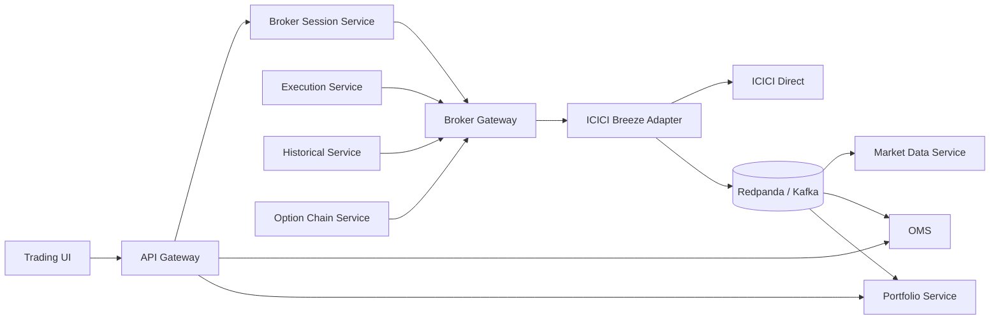

# ICICI Direct Breeze API Integration — Clean Architecture Implementation Plan
## For the Scalable Python Microservices Trading Platform

> **Technology baseline:** Python 3.14.x, FastAPI, Pydantic v2, SQLAlchemy 2.1+, SQLite, Redis, Redpanda/Kafka  
> **Broker SDK:** `breeze-connect==1.0.69` initially pinned and upgraded only after contract/integration tests  
> **Document date:** 16 September 2026  
> **Scope:** ICICI Direct/Breeze connectivity only. Strategy logic remains outside the broker integration.

---

# 1. Purpose

The ICICI Direct integration must not become a collection of direct calls such as:

```python
breeze.place_order(...)
breeze.get_quotes(...)
breeze.get_portfolio_positions(...)
```

spread across the platform.

All ICICI-specific behavior belongs behind one clean broker boundary.

The platform will use:

```text
Application Services
        ↓
Normalized Broker Contracts
        ↓
Broker Gateway
        ↓
ICICI Breeze Adapter
        ↓
breeze-connect SDK
        ↓
ICICI Direct
```

The rest of the platform must not know:

- Breeze SDK method names;
- Breeze request parameter names;
- ICICI response formats;
- ICICI-specific order status strings;
- WebSocket payload formats;
- session-token internals;
- broker rate-limit implementation.

---

# 2. Current Breeze SDK Baseline

Use the official package:

```text
breeze-connect==1.0.69
```

Pin the version in `uv.lock`.

Do not install unpinned `breeze-connect` in production.

The official SDK currently exposes capabilities including:

```text
Session/customer details
Funds
Margin
Historical Data
Historical Data V2
Quotes
Option Chain
Order Placement
Order Modification
Order Cancellation
Order Details/List
Portfolio Positions/Holdings
Trade List/Details
Square Off
Preview Order
Limit Calculator
Margin Calculator
GTT APIs
Live WebSocket Feeds
OHLCV Streaming
Order Notifications
```

Relevant Breeze constraints that the adapter must encode:

```text
Overall API limit:
100 API calls / minute
5,000 API calls / day

Combined order writes:
10 requests / second
(place + cancel + modify + square-off)

Historical V2:
maximum 1,000 candle intervals per request

Historical V2 intervals:
1second
1minute
5minute
30minute
1day

Live OHLC intervals:
1second
1minute
5minute
30minute
```

ICICI currently requires trading requests to originate from the static IP registered with the API app.

The API session must be generated manually each trading day. ICICI states that session-key generation cannot be automated; the key expires after 24 hours or at midnight, whichever occurs first.

---

# 3. Regulatory Order Handling

The Breeze documentation states that normal market orders are not permitted and requests marked as `market` are converted by ICICI into an **aggressive limit order**.

Our platform will **not expose a generic `MARKET` order type**.

Initial domain order styles:

```text
LIMIT
STOP_LIMIT
```

Later, after explicit integration testing, add:

```text
AGGRESSIVE_LIMIT
```

as a deliberate execution policy.

Do not allow strategy code to send:

```text
order_type="market"
```

directly.

This prevents broker-specific behavior from leaking into strategies and makes the execution semantics explicit.

---

# 4. Microservice Boundary

The ICICI SDK belongs only in:

```text
broker-gateway-service
```

No other service imports:

```python
from breeze_connect import BreezeConnect
```

This is a hard architectural rule.

Allowed:

```text
broker-gateway-service
    └── infrastructure/icici/*
```

Forbidden:

```text
strategy-service      → breeze_connect
risk-service          → breeze_connect
execution-service     → breeze_connect
oms-service           → breeze_connect
portfolio-service     → breeze_connect
api-gateway           → breeze_connect
frontend              → Breeze API
```

---

# 5. Service Interaction



The Broker Gateway is a boundary service, not the source of truth for:

- orders;
- positions;
- P&L;
- strategies.

Those belong to OMS/Portfolio/Strategy services.

---

# 6. Clean Architecture Inside Broker Gateway

Use four layers:

```text
domain
application
infrastructure
presentation
```

Dependency direction:

```text
presentation
    ↓
application
    ↓
domain

infrastructure implements domain/application ports
```

The domain layer never imports FastAPI, SQLAlchemy, Redis, Kafka, or Breeze.

---

# 7. Broker Gateway Repository Structure

```text
services/
└── broker-gateway/
    ├── pyproject.toml
    ├── migrations/
    │
    ├── src/
    │   └── broker_gateway/
    │       │
    │       ├── domain/
    │       │   ├── models/
    │       │   │   ├── session.py
    │       │   │   ├── account.py
    │       │   │   ├── instrument.py
    │       │   │   ├── market_data.py
    │       │   │   ├── orders.py
    │       │   │   ├── trades.py
    │       │   │   └── positions.py
    │       │   │
    │       │   ├── enums.py
    │       │   ├── errors.py
    │       │   └── ports/
    │       │       ├── session_port.py
    │       │       ├── account_port.py
    │       │       ├── market_data_port.py
    │       │       ├── trading_port.py
    │       │       ├── portfolio_port.py
    │       │       ├── stream_port.py
    │       │       ├── request_ledger_port.py
    │       │       └── event_publisher_port.py
    │       │
    │       ├── application/
    │       │   ├── commands/
    │       │   │   ├── activate_session.py
    │       │   │   ├── place_order.py
    │       │   │   ├── modify_order.py
    │       │   │   ├── cancel_order.py
    │       │   │   ├── square_off.py
    │       │   │   ├── subscribe_market.py
    │       │   │   └── unsubscribe_market.py
    │       │   │
    │       │   ├── queries/
    │       │   │   ├── get_health.py
    │       │   │   ├── get_funds.py
    │       │   │   ├── get_margin.py
    │       │   │   ├── get_quote.py
    │       │   │   ├── get_historical.py
    │       │   │   ├── get_option_chain.py
    │       │   │   ├── get_orders.py
    │       │   │   ├── get_trades.py
    │       │   │   └── get_positions.py
    │       │   │
    │       │   └── services/
    │       │       ├── broker_service.py
    │       │       ├── execution_guard.py
    │       │       ├── response_validator.py
    │       │       └── historical_paginator.py
    │       │
    │       ├── infrastructure/
    │       │   ├── icici/
    │       │   │   ├── breeze_client.py
    │       │   │   ├── breeze_factory.py
    │       │   │   ├── sdk_runner.py
    │       │   │   ├── session_adapter.py
    │       │   │   ├── account_adapter.py
    │       │   │   ├── market_data_adapter.py
    │       │   │   ├── trading_adapter.py
    │       │   │   ├── portfolio_adapter.py
    │       │   │   ├── websocket_adapter.py
    │       │   │   ├── event_router.py
    │       │   │   ├── request_mapper.py
    │       │   │   ├── response_mapper.py
    │       │   │   ├── status_mapper.py
    │       │   │   ├── datetime_mapper.py
    │       │   │   ├── exceptions.py
    │       │   │   └── constants.py
    │       │   │
    │       │   ├── persistence/
    │       │   │   ├── db.py
    │       │   │   ├── models.py
    │       │   │   └── request_ledger_repository.py
    │       │   │
    │       │   ├── messaging/
    │       │   │   ├── redpanda_publisher.py
    │       │   │   └── outbox_publisher.py
    │       │   │
    │       │   ├── rate_limit/
    │       │   │   ├── redis_limiter.py
    │       │   │   └── policies.py
    │       │   │
    │       │   └── security/
    │       │       ├── secret_provider.py
    │       │       └── session_cipher.py
    │       │
    │       ├── presentation/
    │       │   ├── api/
    │       │   │   ├── session.py
    │       │   │   ├── account.py
    │       │   │   ├── market.py
    │       │   │   ├── orders.py
    │       │   │   └── portfolio.py
    │       │   └── schemas/
    │       │       ├── requests.py
    │       │       └── responses.py
    │       │
    │       ├── bootstrap/
    │       │   ├── settings.py
    │       │   ├── container.py
    │       │   └── lifecycle.py
    │       │
    │       └── main.py
    │
    └── tests/
        ├── unit/
        ├── contract/
        ├── integration/
        ├── fixtures/
        └── live_readonly/
```

---

# 8. Domain Models

Do not return Breeze dictionaries from the Broker Gateway.

Define canonical models.

Example:

```python
@dataclass(frozen=True, slots=True)
class BrokerOrderRequest:
    request_id: UUID
    account_id: UUID
    instrument: BrokerInstrumentRef
    side: OrderSide
    quantity: int
    order_style: OrderStyle
    limit_price: Decimal | None
    stop_price: Decimal | None
    validity: OrderValidity
    client_reference: str
```

Use `Decimal` for all:

```text
prices
P&L
margin
funds
strike prices
```

Do not use binary `float` for trading money.

---

# 9. Broker Instrument Reference

The Broker Gateway does not own the complete instrument master.

It receives a normalized broker reference from Instrument Service:

```python
@dataclass(frozen=True, slots=True)
class BrokerInstrumentRef:
    internal_instrument_id: UUID
    exchange: Exchange
    stock_code: str
    product_type: ProductType
    expiry: date | None
    strike: Decimal | None
    option_right: OptionRight | None
    stock_token: str | None
```

The adapter converts this to Breeze-specific strings.

---

# 10. Ports

Split interfaces by capability rather than one enormous broker interface.

```python
class BrokerSessionPort(Protocol):
    async def activate(self, api_session: SecretStr) -> SessionStatus: ...
    async def validate(self) -> SessionStatus: ...
    async def disconnect(self) -> None: ...
```

```python
class BrokerAccountPort(Protocol):
    async def get_funds(self) -> FundsSnapshot: ...
    async def get_margin(self, exchange: Exchange) -> MarginSnapshot: ...
```

```python
class BrokerMarketDataPort(Protocol):
    async def get_quote(self, instrument: BrokerInstrumentRef) -> Quote: ...
    async def get_historical(self, request: HistoricalRequest) -> list[Candle]: ...
    async def get_option_chain(self, request: OptionChainRequest) -> OptionChainSnapshot: ...
```

```python
class BrokerTradingPort(Protocol):
    async def place_order(self, request: BrokerOrderRequest) -> BrokerOrderAcknowledgement: ...
    async def modify_order(self, request: ModifyBrokerOrderRequest) -> BrokerOrderAcknowledgement: ...
    async def cancel_order(self, request: CancelBrokerOrderRequest) -> BrokerOrderAcknowledgement: ...
    async def square_off(self, request: SquareOffRequest) -> BrokerOrderAcknowledgement: ...
```

---

# 11. Breeze SDK Must Be Treated as Blocking

The official SDK exposes ordinary synchronous methods and callback-driven WebSockets.

Do **not** execute SDK REST methods directly on the FastAPI event loop.

Use:

```text
FastAPI async request
      ↓
Application use case
      ↓
SdkRunner
      ↓
bounded worker thread
      ↓
BreezeConnect method
```

Start conservatively:

```text
one active BreezeConnect runtime per ICICI account
serialized broker writes
bounded broker reads
```

Do not assume the SDK object is thread-safe unless ICICI explicitly documents that behavior.

---

# 12. Breeze Client Lifecycle

Create exactly one owner for the active SDK runtime per account.

```text
BreezeClientManager
     │
     ├── API key
     ├── active session
     ├── BreezeConnect
     ├── REST state
     ├── WebSocket state
     └── connection health
```

State:

```text
UNCONFIGURED
NEEDS_SESSION
ACTIVATING
ACTIVE
DEGRADED
EXPIRED
INVALID
DISCONNECTED
```

---

# 13. Session Flow

ICICI requires a new manually generated API session each day.

```text
UI
 ↓
Broker Session Service
 ↓
Generate ICICI login URL
 ↓
User completes ICICI login manually
 ↓
API_SESSION returned by ICICI
 ↓
User enters API_SESSION into our UI
 ↓
Broker Session Service
 ↓
Broker Gateway /session/activate
 ↓
BreezeConnect.generate_session(...)
 ↓
Validation call
 ↓
ACTIVE
```

Do not attempt to automate credential/OTP/session generation.

---

# 14. Session Secrets

Configuration:

```text
ICICI_API_KEY
ICICI_API_SECRET
ICICI_EXPECTED_PUBLIC_IP
```

Rules:

```text
API Secret:
never sent to frontend
never logged
never put in Kafka

API Session:
never logged
never put in Kafka
never returned after activation

Generated broker session material:
backend only
```

If restart recovery during the same trading day is required, store the daily API session only in encrypted form.

SQLite must never contain plaintext broker credentials.

---

# 15. Session Validation

After:

```python
breeze.generate_session(...)
```

perform a low-risk validation such as:

```text
get_funds()
```

Activation is successful only if session generation and validation both succeed.

---

# 16. Normalizing Breeze Responses

Breeze commonly returns envelopes shaped like:

```text
Success
Status
Error
```

Never let that envelope leak beyond infrastructure.

Create a single `BreezeResponseValidator` used by every REST call.

---

# 17. Error Taxonomy

Normalize SDK/API errors into:

```text
BrokerAuthenticationError
BrokerSessionExpiredError
BrokerAuthorizationError
BrokerValidationError
BrokerRateLimitError
BrokerTimeoutError
BrokerUnavailableError
BrokerOrderRejectedError
BrokerOrderStateConflictError
BrokerMarketDataError
BrokerInstrumentError
BrokerProtocolError
BrokerUnknownError
```

---

# 18. Request Mapper

Centralize all Breeze parameter conversion.

```text
Domain                Breeze
────────────────────────────────
Exchange.NFO          "NFO"
ProductType.OPTION    "options"
OrderSide.BUY         "buy"
OrderSide.SELL        "sell"
OptionRight.CALL      "call"
OptionRight.PUT       "put"
Validity.DAY          "day"
Decimal("125.50")     "125.50"
```

Dates must be converted in one dedicated mapper.

---

# 19. Historical Data Integration

Prefer `get_historical_data_v2(...)`.

The documented V2 maximum is 1,000 candles per request, so arbitrary ranges must be paginated outside the adapter.

Handle:

```text
inclusive/exclusive boundaries
duplicate boundary candles
market holidays
no-data periods
expiry
timeouts
rate limits
```

---

# 20. Quotes

Wrap `get_quotes(...)` and normalize to a canonical Quote model with LTP, bid/ask, quantities, OHLC, volume and OI where available.

Missing broker fields remain `None`; do not invent zero values.

---

# 21. Option Chain

Wrap `get_option_chain_quotes(...)`.

Do not expose Breeze's parameter quirks to the UI. The Option Chain Service asks in domain terms, and Broker Gateway determines the Breeze request.

Normalize:

```text
strike
right
LTP
bid/ask
volume
OI
change OI
spot price
upper/lower circuit
```

---

# 22. WebSocket Architecture

Breeze SDK uses callback-driven WebSockets.

```text
Breeze socket callback
        ↓
BreezeEventRouter
        ↓
bounded internal queue
        ↓
normalizer
        ↓
Redpanda publisher
        ↓
market/OMS consumers
```

The callback must remain lightweight. No SQLite writes, HTTP calls, strategy logic or P&L calculations inside `on_ticks`.

---

# 23. Market Streaming

Breeze supports `ws_connect()` and `subscribe_feeds(...)`, including NFO option subscriptions and OHLC intervals.

Market Data Service requests subscriptions through Broker Gateway; it does not own a Breeze SDK object.

---

# 24. Order Notifications

Breeze supports:

```python
breeze.subscribe_feeds(get_order_notification=True)
```

Broker Gateway subscribes once per active account, normalizes updates, and publishes them to OMS.

REST order reconciliation remains mandatory.

---

# 25. WebSocket Health

Track separately:

```text
market_socket_connected
order_socket_connected
ohlc_socket_connected
last_market_event_at
last_order_event_at
subscription_count
reconnect_count
last_reconnect_at
```

---

# 26. Reconnection

On disconnect:

```text
1. mark feed DEGRADED/DOWN
2. publish connection event
3. reconnect with bounded exponential backoff
4. restore subscriptions
5. restore order notification subscription
6. trigger REST order reconciliation
7. mark healthy after successful resubscription
```

---

# 27. Account APIs

Phase-1 read APIs:

```text
get_customer_details
get_funds
get_margin
```

Apply an explicit allow-list mapper so unnecessary customer/bank data is not propagated.

---

# 28. Orders Read APIs

Integrate before writes:

```text
order_list
get_order_detail
```

Normalize broker and exchange IDs, quantities, price, average price, raw status, normalized status and timestamps.

Keep both raw and normalized broker status.

---

# 29. Trades and Positions

Integrate:

```text
get_trade_list
get_trade_detail
get_portfolio_positions
```

Broker Gateway normalizes; Portfolio Service remains the authoritative local P&L/position domain.

---

# 30. Live Order Placement

Only Execution Service may call Broker Gateway's internal write endpoint.

No frontend route may invoke Broker Gateway order APIs directly.

---

# 31. Broker Write Idempotency

Use two layers:

```text
Execution Service idempotency
+
Broker Gateway idempotency
```

Broker Gateway SQLite database:

```text
data/broker-gateway/broker_gateway.db
```

`broker_write_requests` includes unique `request_id`, request hash, state, broker order ID and sanitized result.

States:

```text
RECEIVED
SUBMITTING
ACKNOWLEDGED
SUBMISSION_UNKNOWN
REJECTED
FAILED_SAFE
```

---

# 32. Place-Order Algorithm

```text
receive request
    ↓
validate request_id
    ↓
existing ACKNOWLEDGED?
    ├─ YES → return stored acknowledgement
    └─ NO
        ↓
reserve request atomically
        ↓
validate active broker session
        ↓
obtain write rate permit
        ↓
mark SUBMITTING
        ↓
call breeze.place_order()
        ↓
response?
  ┌─────┴──────────┐
 YES             TIMEOUT/UNKNOWN
  │                │
validate          mark
response          SUBMISSION_UNKNOWN
  │                │
store ack         reconcile before retry
```

Never blindly retry `place_order`.

---

# 33. User Remark / Correlation

When supported, use a compact safe correlation tag in `user_remark`.

Maintain the full mapping locally. Never put secrets or full strategy parameters into broker remarks.

---

# 34. Modify / Cancel / Square Off

All are idempotently controlled and rate limited.

For uncertain modify/cancel results, query current order state before retrying.

Square-off remains part of the normal controlled execution path; it is not a bypass.

Initially use explicit limit-price exits.

---

# 35. Rate Limiter

Documented Breeze limits:

```text
100 calls/minute
5,000 calls/day
10 combined order writes/second
```

Use Redis-backed limits with operational headroom, for example:

```yaml
calls_per_minute: 90
calls_per_day: 4800
order_writes_per_second: 8
```

Keep official hard limits separately in configuration.

---

# 36. Timeouts

Because SDK calls are synchronous, an application timeout does not necessarily prove the broker did not receive an order.

For writes:

```text
caller timeout → SUBMISSION_UNKNOWN
```

not:

```text
FAILED
```

This is mandatory.

---

# 37. SQLite Broker Gateway Database

Tables:

```text
broker_write_requests
broker_call_audit
session_runtime_metadata
subscription_registry
outbox_events
processed_events
```

Use:

```sql
PRAGMA journal_mode = WAL;
PRAGMA foreign_keys = ON;
PRAGMA busy_timeout = 5000;
PRAGMA synchronous = FULL;
```

OMS still owns order state.

---

# 38. Events Published by Broker Gateway

```text
broker.session.active.v1
broker.session.expired.v1
broker.session.invalid.v1
broker.connection.changed.v1
broker.market.quote.v1
broker.market.candle.v1
broker.order.notification.v1
broker.order.write_result.v1
broker.trade.snapshot.v1
broker.health.changed.v1
broker.rate_limit.warning.v1
```

---

# 39. Internal HTTP API

Prefix:

```text
/internal/v1
```

Session:

```text
POST /session/activate
GET  /session/status
POST /session/validate
POST /session/disconnect
```

Account:

```text
GET /account/funds
GET /account/margin
```

Market:

```text
POST /quotes
POST /historical
POST /option-chain
POST /subscriptions
DELETE /subscriptions/{subscription_id}
```

Orders:

```text
GET  /orders
GET  /orders/{broker_order_id}
POST /orders
POST /orders/{broker_order_id}/modify
POST /orders/{broker_order_id}/cancel
POST /positions/square-off
```

Trades/positions:

```text
GET /trades
GET /trades/{broker_order_id}
GET /positions
```

These endpoints remain internal-only.

---

# 40. Static IP

Only Broker Gateway should normally require direct ICICI network access.

```text
Broker Gateway
      ↓
fixed server/NAT
      ↓
registered static IP
      ↓
ICICI Direct
```

Add a startup egress diagnostic but do not put an external IP-echo check in the order critical path.

---

# 41. SDK Upgrade Policy

Current pin:

```text
breeze-connect==1.0.69
```

Upgrade only after:

```text
unit tests
fixture contract tests
parser tests
live read-only smoke tests
WebSocket tests
paper execution regression
explicit approval
```

Never auto-deploy a newly released broker SDK into LIVE.

---

# 42. Contract Test Fixtures

Maintain sanitized fixtures for:

```text
customer details
session failure
funds
NFO margin
quote
option chain
historical options
order list/detail
trade list/detail
positions
place-order success/rejection
modify/cancel
timeout
WebSocket quote
WebSocket OHLC
WebSocket order notification
unknown broker status
```

---

# 43. Implementation Phases

## Phase 1 — SDK Bootstrap

```text
breeze-connect==1.0.69
BreezeClientManager
SdkRunner
settings/secrets
response validator
base errors
health endpoint
SQLite gateway DB
```

## Phase 2 — Session

```text
login URL
manual API_SESSION activation
generate_session
validation
expiry
encrypted same-day recovery if required
```

## Phase 3 — Read-Only Account

```text
customer details
funds
NFO margin
```

## Phase 4 — Market REST

```text
quotes
historical V2
historical pagination
option chain
```

## Phase 5 — Market WebSockets

```text
ws_connect
subscribe/unsubscribe
quote/OHLC normalization
reconnect
subscription restoration
Redpanda publishing
```

## Phase 6 — Orders/Portfolio Read

```text
orders
order detail
trades
positions
reconciliation
```

## Phase 7 — Order Notifications

```text
get_order_notification subscription
normalization
OMS events
reconnect/reconciliation
```

## Phase 8 — Write Guard

```text
idempotency ledger
request hashing
write rate limiter
session guard
SUBMISSION_UNKNOWN
metrics
```

## Phase 9 — LIMIT Order Placement

```text
place_order
correlation remark
ack normalization
unknown-result recovery
```

## Phase 10 — Modify / Cancel

## Phase 11 — Square Off

## Phase 12 — Advanced

```text
preview_order
limit_calculator
margin_calculator
aggressive-limit policy
GTT only if required
```

---

# 44. Initial Configuration

```yaml
broker:
  provider: icici_direct

  sdk:
    package: breeze-connect
    version: "1.0.69"

  session:
    manual_generation_required: true
    encrypted_persistence: true

  limits:
    operating:
      calls_per_minute: 90
      calls_per_day: 4800
      order_writes_per_second: 8

    hard:
      calls_per_minute: 100
      calls_per_day: 5000
      order_writes_per_second: 10

  execution:
    allow_live_writes: false
    allow_aggressive_limit: false
```

Environment:

```text
ICICI_API_KEY=
ICICI_API_SECRET=
ICICI_EXPECTED_PUBLIC_IP=
BROKER_SESSION_ENCRYPTION_KEY=
```

---

# 45. Safe Defaults

Always start with:

```text
allow_live_writes = false
allow_aggressive_limit = false
```

Credentials existing must never automatically enable LIVE trading.

---

# 46. Hard Rules

```text
1. Only broker-gateway imports breeze_connect.
2. Pin the Breeze SDK version.
3. Never expose Breeze dictionaries outside infrastructure.
4. Use Decimal for money.
5. Keep SDK REST calls off the FastAPI event loop.
6. Do not assume BreezeConnect is thread-safe.
7. Serialize broker writes.
8. Centralize response validation.
9. Centralize request/date mapping.
10. Keep session generation manual.
11. Never log broker secrets/session tokens.
12. Broker Gateway owns broker WebSockets.
13. WebSocket callbacks do almost no work.
14. REST reconciliation backs order WebSocket state.
15. Enforce historical request limits.
16. Enforce broker rate limits centrally.
17. Every write has idempotency.
18. Never blindly retry place_order.
19. Start live execution with LIMIT only.
20. Keep raw + normalized broker status.
21. OMS owns orders.
22. Portfolio owns position/P&L.
23. Strategies never know Breeze exists.
```

---

# 47. Target Live Order Path

```text
Strategy / Manual UI
        ↓
OrderIntent
        ↓
OMS
        ↓
Risk
        ↓
Execution
        ↓
Broker Gateway
        ↓
Idempotency Ledger
        ↓
Session Guard
        ↓
Rate Limiter
        ↓
ICICI Adapter
        ↓
BreezeConnect.place_order()
        ↓
ICICI Direct
        ↓
Normalized Ack
        ↓
Execution / OMS
```

Separately:

```text
ICICI Order WebSocket
        ↓
Broker Gateway
        ↓
broker.order.notification.v1
        ↓
OMS
        ↓
Portfolio
        ↓
UI
```

---

# 48. Acceptance Gate Before Strategy Work

```text
[ ] SDK pinned
[ ] manual session activation works
[ ] session expiry handled
[ ] secrets do not leak
[ ] funds works
[ ] NFO margin works
[ ] quotes work
[ ] historical V2 works
[ ] >1000 candle pagination works
[ ] option chain works
[ ] market WebSocket works
[ ] OHLC streaming works
[ ] reconnect works
[ ] subscription restoration works
[ ] order list/detail works
[ ] trade list/detail works
[ ] positions work
[ ] order notification stream works
[ ] REST reconciliation works
[ ] rate limiting works
[ ] broker write idempotency works
[ ] timeout → SUBMISSION_UNKNOWN works
[ ] duplicate-order test passes
[ ] LIMIT place order manually tested
[ ] modify manually tested
[ ] cancel manually tested
[ ] square-off manually tested
[ ] metrics/tracing work
[ ] static egress IP verified
```

Only then should actual options strategies consume this integration.

---

# 49. Official References

- Breeze Connect PyPI  
  https://pypi.org/project/breeze-connect/

- Official Breeze Python SDK  
  https://github.com/Idirect-Tech/Breeze-Python-SDK

- Breeze API reference  
  https://api.icicidirect.com/breezeapi/documents/index.html

- ICICI Direct Breeze API  
  https://www.icicidirect.com/futures-and-options/api/breeze

Recheck the official broker documentation before each SDK upgrade because broker behavior and regulatory constraints can change.
